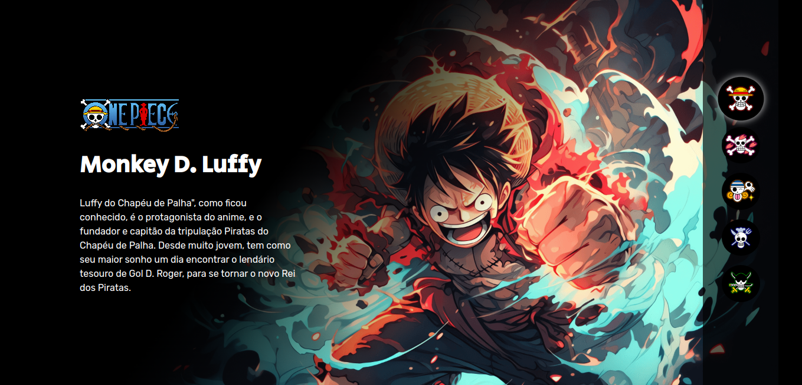
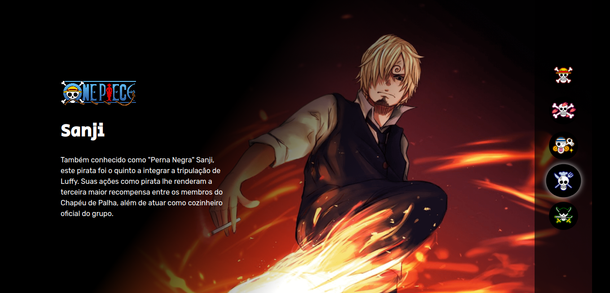
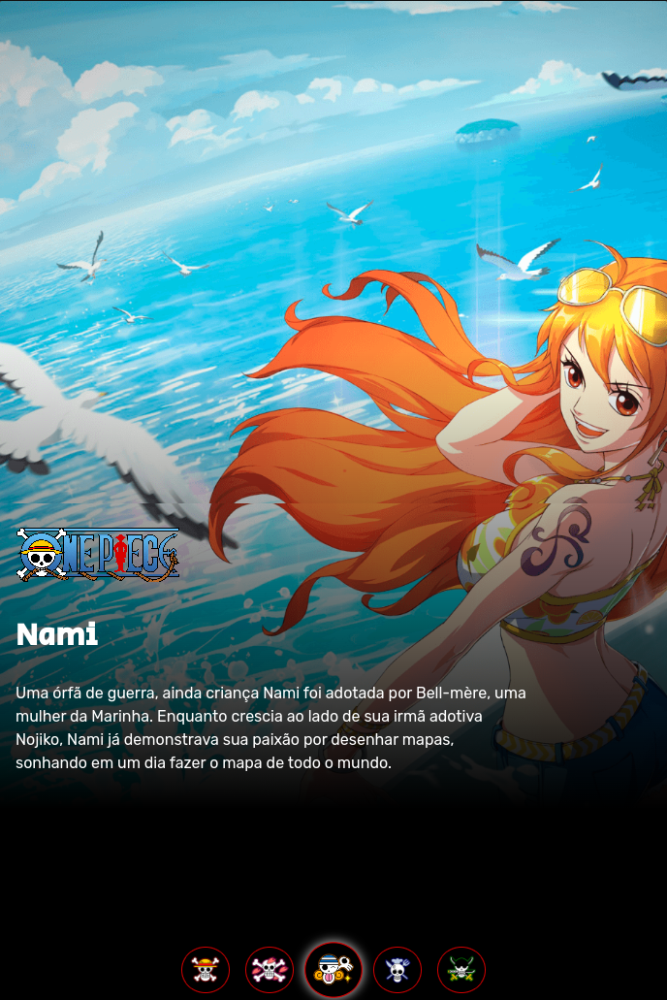
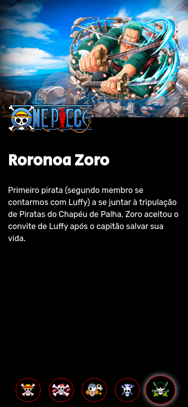

<!-- CABEÇALHO -->

    <h1>
        
    </h1>
    

        <a href="#%EF%B8%8F-sobre-o-projeto">Sobre o Projeto</a> •
        <a href="#-funcionalidades">Funcionalidades</a> •
        <a href="#-layout">Layout</a> •
        <a href="#%EF%B8%8F-tecnologias">Tecnologias</a> •
        <a href="#-autor">Autor</a>
    

<!-- SOBRE O PROJETO -->

## 🖥️ Sobre o Projeto

    
     
     
    

 

> Projeto desenvolvido durante a Semana do Zero ao Programador Contratado do [Dev em Dobro](https://devemdobro.com/)

Este projeto trata-se de uma aplicação simples de front-end com a temática do anime e mangá One Piece.

O objetivo da aplicação é exibir informações sobre um personagem escolhido. O intuito da realização desse projeto foi rever e treinar HTML, CSS e JavaScript puro, que são os conceitos base e fundamentais do front-end.

<!-- FUNCIONALIDADES -->

## 💡 Funcionalidades

- [x] Seleção de personagem
- [x] Exibição de informações sobre cada personagem
- [x] Responsividade

<!-- LAYOUT -->

## 🎨 Layout

  

  
  
  

<!-- TECNOLOGIAS -->

## 🛠️ Tecnologias

Para o desenvolvimento desse projeto, as seguintes ferramentas foram utilizadas:

- **[HTML](https://developer.mozilla.org/en-US/docs/Web/HTML)**
- **[CSS](https://developer.mozilla.org/en-US/docs/Web/CSS)**
- **[JavaScript](https://developer.mozilla.org/en-US/docs/Web/JavaScript)**
- **[DOM](https://developer.mozilla.org/en-US/docs/Web/API/Document_Object_Model)**

## 👨‍💻 Autor

Marcos Kenji Kuribayashi

 

---

Desenvolvido por Marcos Kenji Kuribayashi 😉
